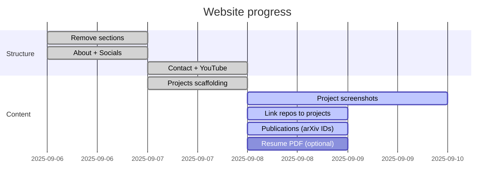

## Checklist

- [x] Remove blog/reading/teaching/people sections
- [x] Update socials (GitHub, LinkedIn, Scholar, email)
- [x] Update scholar config & About page
- [x] Scaffold six projects and remove extras
- [x] Convert resume to JSON and wire CV page
- [x] Add YouTube page
- [x] Add Contact page
- [ ] Add project screenshots in `assets/img/` (see filenames on Projects)
- [ ] Add GitHub links to each project front matter
- [ ] Replace arXiv `eprint` IDs for two publications
- [ ] Upload `assets/pdf/resume.pdf` for download button (optional)

## Timeline

Tip: You can edit this page directly to update status. The Mermaid chart updates on commit.

